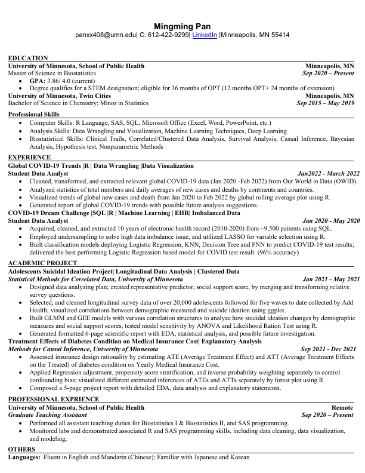

```{r, warning=FALSE, include=FALSE}
resume <- pdftools::pdf_render_page("./Resume_MingmingPan.pdf", page = 1)
png::writePNG(resume, "resume.png")
```

```{r, fig.align="center", out.width="70%", echo=FALSE}

```
